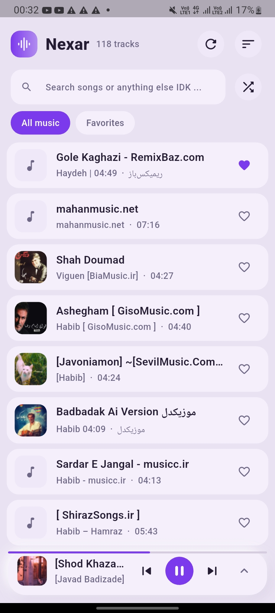
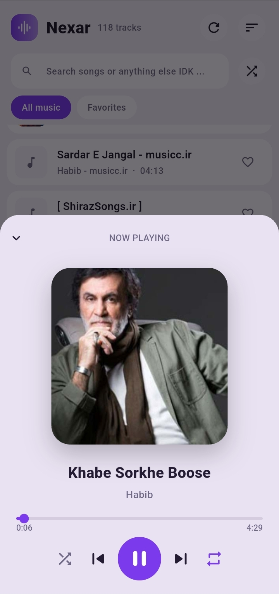
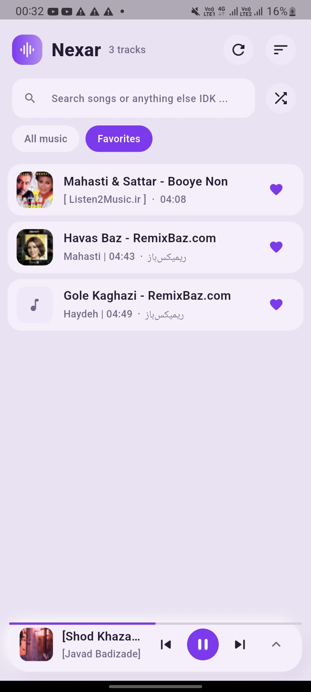

# Nexar Music

A modern, lightweight local music player built with Flutter.

Nexar Music is a personal project I've been working on to build a music player that feels simple, fast, and actually enjoyable to use. It focuses on playing music that is already stored on your device, while keeping the interface clean and responsive.

«Nexar Music is still under active development.
Some features are experimental or unfinished and may change over time.»

---

## Screenshots

Home

Now Playing

Favorites 

---

## Features

### Local Music Library

Nexar Music scans music files stored on your device and builds a local library from them.

- Automatic music scanning
- Reads audio metadata
- Artist, album, title and duration information
- Handles large music libraries
- Duplicate song detection
- Favorites
- Search
- Sorting
- Shuffle all
- Persistent library cache

The goal is to make opening the app feel instant instead of rescanning everything every time.

---

## Fast Library Loading

One of the things I wanted to avoid was making the user wait for the entire library to load.

Nexar Music uses a local cache for scanned music and checks file information such as modification time and size to determine whether a file needs to be processed again.

Metadata parsing is also performed away from the main UI thread so that large libraries don't freeze the interface.

This makes subsequent launches significantly faster than doing a full scan every time.

---

## Background Playback

Android background playback is supported using "media_kit" and "audio_service".

The player can continue playing when:

- The screen is locked
- The app is in the background
- The user switches to another app

Android media controls are also provided through the system notification.

The notification can display:

- Song title
- Artist
- Album artwork
- Play / pause
- Previous
- Next

---

## Artwork

Album artwork is loaded lazily instead of loading every image immediately.

Nexar Music uses an in-memory cache for artwork to reduce unnecessary file reads and improve scrolling performance.

Artwork used by the Android media notification can also be cached separately.

---

## Neumorphic UI

The current interface is based around a Neumorphic design.

The idea is to keep the UI visually distinctive without making the player difficult to use.

The interface also adapts to different screen sizes, so the desktop layout doesn't simply look like a stretched mobile application.

---

## Responsive Layout

The layout changes depending on the available screen width.

On larger screens, additional navigation and player controls can be displayed, while smaller screens use a more compact layout.

This allows the same codebase to work across desktop and mobile form factors.

---

## Favorites

Songs can be marked as favorites.

Favorite state is persisted locally, so restarting the application doesn't reset your library.

---

## Search

A simple search system is included for quickly finding songs in the local library.

---

## Sorting

The library can be sorted according to the available sorting options.

The selected sorting preference is saved locally and restored when the application starts again.

---

⌨️ Keyboard Controls

Basic keyboard interaction is supported on desktop.

For example:

"Space" → Play / Pause

More keyboard shortcuts may be added later.

---

## Tech Stack

Nexar Music is built with Flutter and uses a few packages that handle the parts that would otherwise be unnecessarily complicated to implement from scratch.

Technology| Purpose
Flutter| UI and cross-platform application
Dart| Main programming language
Riverpod| State management
media_kit| Audio playback
media_kit_libs_audio| Native audio libraries
audio_service| Background playback and media controls
audio_metadata_reader| Reading audio metadata
shared_preferences| Local preferences and library cache
permission_handler| Android permissions
path_provider| Local file paths and artwork cache
audio_video_progress_bar| Player progress UI
liquid_glass_bridge| Experimental Liquid Glass UI
flutter_launcher_icons| Application icons

---

## Project Structure

The project is split into a few main areas:

lib/
├── main.dart
│
├── components/
│   ├── design_system.dart
│   ├── dialogs.dart
│   ├── full_player_view.dart
│   ├── player_bar.dart
│   └── song_tile.dart
│
├── screens/
│   ├── home_screen.dart
│   └── now_playing_sheet.dart
│
└── services/
    ├── models.dart
    ├── providers.dart
    ├── audio_handler.dart
    ├── audio_service.dart
    ├── artwork_repository.dart
    ├── library_cache.dart
    └── utils.dart

Most of the application logic lives inside "services/", while reusable UI components are kept inside "components/".

---

## A Little About the Architecture

I tried to keep the application reasonably modular instead of putting everything inside the screens.

State Management

Riverpod is used to manage application state and connect the UI with the player and library.

Audio

"media_kit" handles the actual playback engine.

"audio_service" is used alongside it to provide Android background playback and system media controls.

Metadata Parsing

Audio files can contain a lot of metadata, and parsing hundreds or thousands of files directly on the UI thread isn't a great idea.

Nexar Music processes metadata in isolates so the UI remains responsive while the library is being scanned.

Library Cache

The library cache stores information about previously scanned files.

When the application starts, it can compare stored information with the current files instead of rebuilding everything from scratch.

Artwork Cache

Artwork is loaded only when needed and cached in memory to avoid repeatedly reading the same images.

---

## Supported Platforms

Currently the project is mainly focused on:

- Android
- Windows
- Linux
- macOS

Android receives additional work for background playback, notifications and storage/audio permissions.

iOS support is not currently the main focus of the project and may require additional work.

---

## Getting Started

Requirements

Make sure you have Flutter installed and configured correctly.

You can check your environment with:

flutter doctor

Clone the repository

git clone https://github.com/mr-command/nexar_music.git
cd nexar_music

Install dependencies

flutter pub get

Run the application

For a connected device:

flutter run

You can also specify a platform:

flutter run -d windows

or:

flutter run -d linux

or:

flutter run -d macos

For Android:

flutter run -d android

---

## Building

Android

To create a release APK:

flutter build apk --release

For an Android App Bundle:

flutter build appbundle --release

Windows

flutter build windows --release

Linux

flutter build linux --release

macOS

flutter build macos --release

---

## Roadmap

Nexar Music is still evolving, so this list will probably change.

Player

- [x] Play / Pause
- [x] Previous / Next
- [x] Shuffle
- [x] Progress bar
- [x] Background playback
- [x] System media controls
- [ ] Repeat modes
- [ ] Queue management
- [ ] Sleep timer

Library

- [x] Local music scanning
- [x] Metadata parsing
- [x] Favorites
- [x] Search
- [x] Sorting
- [x] Library caching
- [x] Duplicate detection
- [ ] Saved playlists
- [ ] Custom folders
- [ ] Album / Artist pages

Audio

- [x] Local audio playback
- [x] Background playback
- [ ] Equalizer
- [ ] Audio effects
- [ ] Gapless playback improvements

UI

- [x] Responsive layout
- [x] Neumorphic design
- [x] Theme system foundation
- [ ] Improved theme customization
- [ ] Liquid Glass UI
- [ ] More animations and transitions

Lyrics & Metadata

- [ ] Lyrics support
- [ ] Better metadata editing
- [ ] More album information

---

🧪 Experimental Features

Liquid Glass

There is currently an experimental Liquid Glass implementation in the project.

It is not finished yet and is currently marked as broken.

I'm keeping it in the project because I still want to experiment with the design and potentially bring it back once it becomes stable enough.

---

🐛 Known Issues

Because Nexar Music is still being developed, there are things that aren't perfect yet.

Some known areas that need more work:

- Liquid Glass design is currently broken
- iOS support is incomplete
- More automated tests are needed
- Some parts of the UI still need polishing
- More advanced playlist management is not implemented yet
- Audio features such as an equalizer are not available yet

If you find something else, feel free to open an issue.

---

🤝 Contributing

Nexar Music is primarily a personal project, but contributions and suggestions are welcome.

If you want to contribute:

1. Fork the repository
2. Create a new branch
3. Make your changes
4. Test the application
5. Open a pull request

For larger changes, opening an issue first is probably a good idea so we can discuss the approach.

---

💡 Why I Made This

There are already a lot of music players out there.

This project started mostly because I wanted to build one myself and see how far I could take it with Flutter.

Along the way it became a good place to experiment with things like:

- Flutter desktop development
- Riverpod
- Audio playback
- Background services
- Audio metadata
- Isolates
- Local caching
- Responsive UI
- Cross-platform development

It's still not where I want it to be, but that's kind of the point of the project.

I'm continuing to improve it as I use it and find things that could be better.

---

📄 License

A license has not been added to the project yet.

Until a license is added, the repository should not be assumed to grant permission to copy, modify, distribute, or reuse the code.

---

⭐ Support

If you like the project, consider giving it a star ⭐

It helps me know that people are actually interested in seeing Nexar Music continue.

---

📸 More Screenshots Coming Soon

I'm planning to add more screenshots here as the UI develops.

Some of the screenshots I'd like to include:

- Home screen
- Full player
- Mini player
- Library
- Favorites
- Search
- Android notification
- Desktop version
- Different themes

---

Nexar Music — a music player built with Flutter, one feature at a time.
